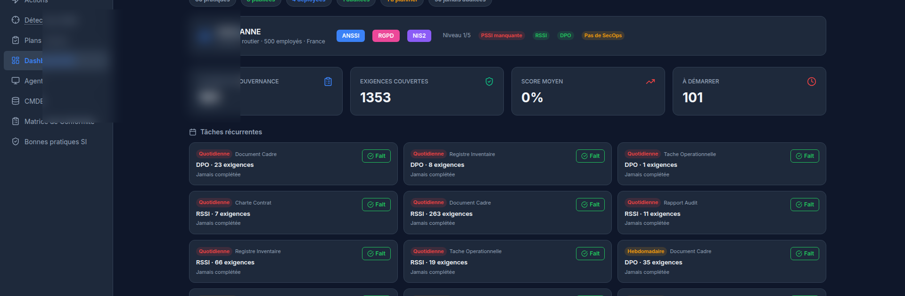
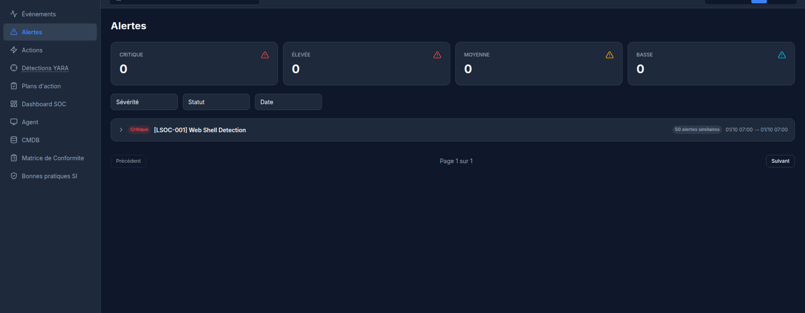
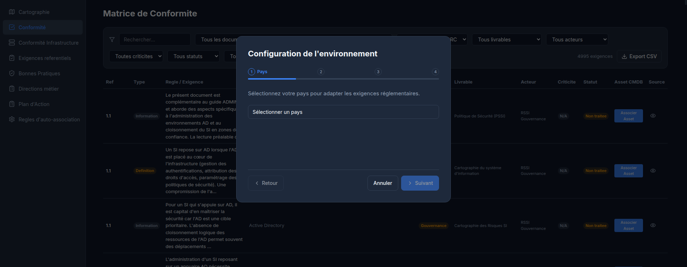
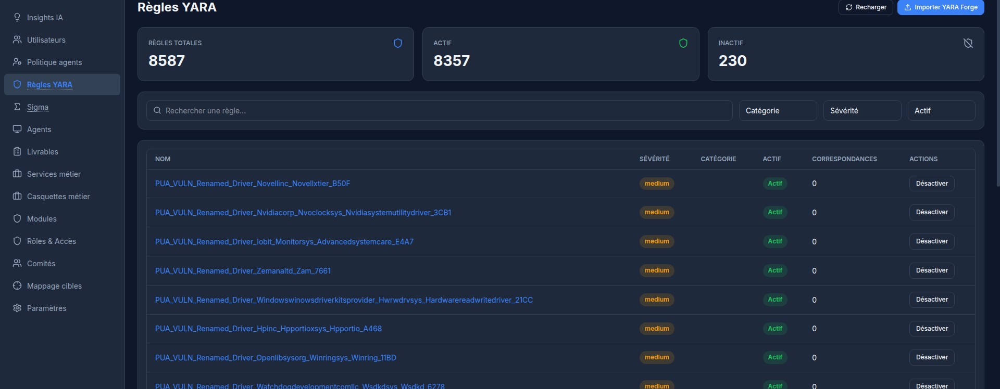

# LogSOC Frontend

> **LogSOC** = **L**ibre · **O**pen · **G**ouvernance · **S**écurité · **O**pérations · **C**onformité

Interface web de la plateforme **LogSOC** : React 18 + TypeScript strict + Vite + Tailwind CSS.

## Aperçu

| Dashboard | Alertes |
|:-:|:-:|
|  |  |

| Matrice de conformité | Règles YARA |
|:-:|:-:|
|  |  |

## Fonctionnalités de l'interface

- **96 pages applicatives** — 7 sections : Gouvernance, Protection des Données, Conformité, Opérations, Audit, Gestion de crise, Administration
- **i18n complet** — 4 langues (FR, EN, DE, ES)
- **Dashboard adaptatif par rôle** — 9 rôles (viewer → superadmin), tâches générées dynamiquement depuis les exigences
- **Temps réel** — WebSocket (heartbeat 30 s) pour les événements et alertes
- **Éditeur documentaire** — OnlyOffice intégré (édition, visionneuse PDF figée, circuit de signature)

## Stack

React 18.3 · TypeScript 5.7 strict · Vite 6 · Tailwind 4 · zustand 5 · TanStack Query 5 · recharts 2.15

## Build

```bash
npm install
npm run build     # tsc -b strict + vite build → dist/
```

La variable `VITE_API_URL` doit rester vide en production (le reverse-proxy sert `/api/` et `/ws/`).

Voir [`logsoc`](https://github.com/logsoc-oss/logsoc) (backend) et [`logsoc-agent`](https://github.com/logsoc-oss/logsoc-agent) (agents natifs) — documentation complète d'installation : `docs/INSTALLATION.md` du dépôt backend.

## Licence

Ce projet est distribué sous licence **GNU AGPL-3.0** — voir [LICENSE](LICENSE).
